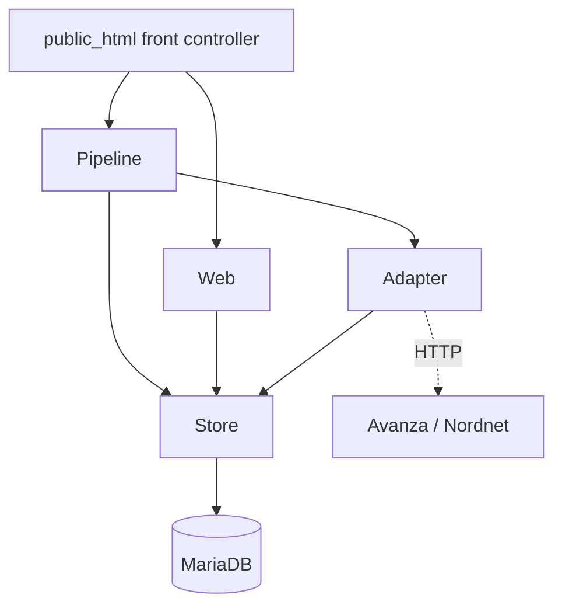
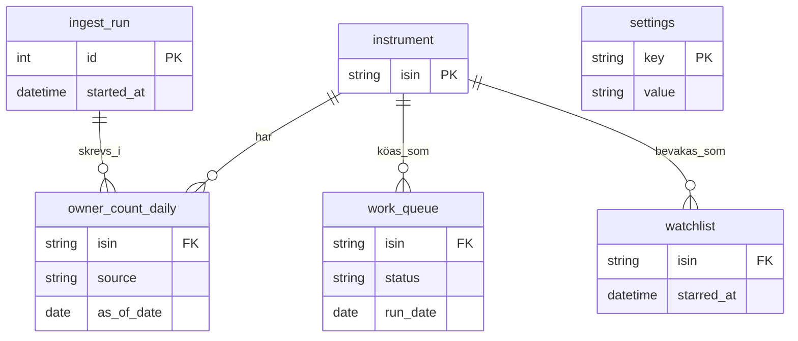
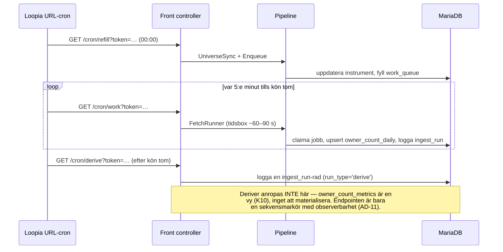
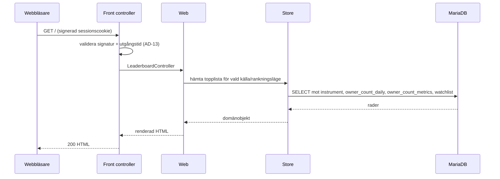
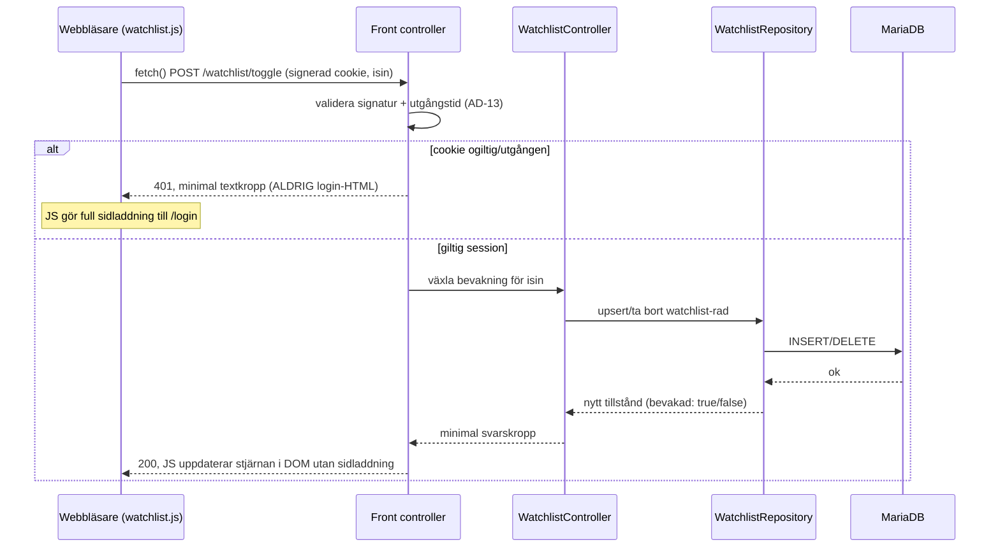

# Architecture Spine — Stockpicker

> _2026-09-10: universumkällan bytt Börsdata → Avanzas publika listning (Börsdatas API
> kräver betald Pro). `BorsdataAdapter` → `AvanzaUniverseAdapter`. Se
> `sprint-change-proposal-2026-09-10.md`._

## Design Paradigm

**Pipes-and-filters** för dataflödet, **ports-and-adapters** för externa källor.

Nattkörningen är en kedja av filter med tydligt in/ut-kontrakt mellan varje steg:

```
universe-sync → enqueue → fetch → normalize → upsert → derive
```

Varje extern källa (Avanza, Nordnet) når systemet bara genom en adapter i `src/Adapter/`
— ägarsiffror bakom `SourceAdapter`-porten, universumlistningen genom en egen
adapterklass. Pipeline-kärnan känner aldrig HTTP, endpoint-vägar eller källspecifika
fältnamn.

Lagermappning:

| Lager | Katalog | Ansvar |
| --- | --- | --- |
| Front controller | `public_html/` | Tar emot cron-anrop, autentiserar token, startar pipeline-steg. Ingen affärslogik. |
| Pipeline | `src/Pipeline/` | Filtren: `UniverseSync`, `Enqueue`, `FetchRunner`, `Normalizer`, `Deriver`. |
| Adapter | `src/Adapter/` | `SourceAdapter`-interface + `AvanzaAdapter`, `NordnetAdapter`; universumadaptern `AvanzaUniverseAdapter` (egen klass). |
| Store | `src/Store/` | PDO-repositories. Enda vägen till databasen. |
| Web | `src/Web/` | Request/response-hantering för det människovända UI:t (topplista, fullständig lista, aktiedetalj, bevakningslista). Anropar bara `src/Store/`. Sidoordnat med `src/Pipeline/` (den nattliga batchkedjan) — inte ett substitut för den. |

`src/Web/` och `src/Pipeline/` anropar aldrig varandra.

## Invariants & Rules



Tillåten beroenderiktning: front controller → pipeline → adapter/store; front controller → web
→ store; adapter → store. Inget lager beror uppåt. Store beror inte på pipeline, adapter eller
web. Web anropar aldrig Pipeline eller Adapter.

### AD-1 — Pipes-and-filters med källadaptrar bakom en port

- **Binds:** all
- **Prevents:** att HTTP-egenheter, endpoint-vägar och källspecifik parsning läcker in i
  pipeline-kärnan och binder den till en viss källa.
- **Rule:** All åtkomst till en extern källa sker genom en klass som implementerar
  `SourceAdapter`. Pipeline-steg anropar bara adaptergränssnittet. Ingen `curl`/Guzzle,
  ingen käll-URL och ingen käll-DOM utanför `src/Adapter/`.

### AD-2 — Adaptern returnerar normaliserad rad eller typat fel

- **Binds:** `src/Adapter/`, `src/Pipeline/FetchRunner`, `Normalizer`
- **Prevents:** att kärnan grenar på statuskoder eller råsvar, och att olika adaptrar
  rapporterar fel på oförenliga sätt.
- **Rule:** En `fetch`-adapter returnerar antingen
  `{isin, source, as_of_date, number_of_owners, last_price, market_cap, fetched_at}`
  eller ett typat fel som ärver `AdapterError`: `SchemaMismatch`, `NotFound`, `Transient`
  (samt `RateLimited`, en subtyp av `Transient` för HTTP 429). Kärnan agerar bara på
  dessa typer, aldrig på rå HTTP-status eller ett obehandlat Guzzle-undantag.

### AD-3 — Dataägande: en skribent per rad `[ADOPTED]`

- **Binds:** `instrument`, `owner_count_daily`, `Deriver`
- **Prevents:** dubbla skribenter på samma rad och kapplöpning mellan källor.
- **Rule:** `instrument`-tabellen skrivs bara av `UniverseSync` (via
  `AvanzaUniverseAdapter`) — inklusive cachning av Avanza `orderbookId` (ur listningen)
  och uppslag + cachning av Nordnet `nnx_instrument_id`.
  `FetchRunner` slår aldrig upp ett saknat id lat; ett instrument utan id hoppas över och
  loggas tills nästa `UniverseSync`. `owner_count_daily` är källindelad —
  `AvanzaAdapter`-flödet skriver bara rader med `source = 'avanza'`, Nordnet bara sina.
  `Deriver` och allt härlett läser fakta, skriver dem aldrig.

### AD-4 — Idempotent upsert på naturlig nyckel

- **Binds:** `src/Store/`, `owner_count_daily`
- **Prevents:** dubbletter när ett steg eller en hel körning körs om.
- **Rule:** All faktalagring är upsert med `(isin, source, as_of_date)` som nyckel.
  Ett omkört steg för samma dygn ger samma sluttillstånd.

### AD-5 — Återupptagbar, tidsboxad kökörning

- **Binds:** `public_html/` cron-endpoints, `Enqueue`, `FetchRunner`, `work_queue`
- **Prevents:** att en körning antar att den hinner klart i ett anrop (Loopias
  URL-cron kör över webbservern med okänd timeout) och att överlappande cron-scheman tar
  samma jobb.
- **Rule:** Inget pipeline-steg får förutsätta att det slutförs i en enda invokation.
  `FetchRunner` claimar köjobb atomiskt (`UPDATE work_queue SET status='claimed', …
  WHERE status='pending' … LIMIT n`), arbetar en tidsbox (default ~60–90 s) och avslutar
  rent. Den dagliga cron:en fyller kön; 5-minuters-cron:en betar av den tills den är tom.
- **Kö-tillståndsmaskin:** `pending → claimed → done | failed`. Bara `Enqueue` skapar
  `pending`-rader; bara `FetchRunner` gör övriga övergångar. En `claimed`-rad äldre än
  `queue.stale_after` (i `settings`) återöppnas till `pending` vid nästa körning — så en
  tidsbox som avbryts mitt i inte lämnar jobb fast.

### AD-6 — Delfel avbryter aldrig en körning

- **Binds:** `FetchRunner`, `src/Store/`, `ingest_run`
- **Prevents:** att ett trasigt instrument eller en nere källa stoppar allt annat.
- **Rule:** `NotFound` och `SchemaMismatch` loggas per instrument och körningen går
  vidare. `Transient` återförsöks med exponentiell backoff, sedan lämnas jobbet för
  nästa körning. Efter varje slice framgår antal lyckade/misslyckade per källa.

### AD-7 — Schemakontroll vid adaptergränsen

- **Binds:** `src/Adapter/`
- **Prevents:** att en tyst fältändring hos en inofficiell endpoint sparas som `null`.
- **Rule:** Varje adapter validerar svaret mot ett förväntat schema. Saknat eller
  förändrat fält ⇒ `SchemaMismatch` (aldrig ett tomt värde vidare), loggas på
  `warning`-nivå och räknas i `ingest_run`.

### AD-8 — Hemligheter i fil, drift-parametrar i tabell

- **Binds:** `config.php`, `settings`-tabellen, all kod som läser konfiguration
- **Prevents:** hemligheter i webroot eller i versionshanteringen, och att en
  parameterändring kräver deploy.
- **Rule:** DB-uppgifter och cron-token ligger i `config.php` utanför `public_html/`.
  Drift-parametrar (kör-inte-före-tid för K3, batchstorlek, anrop/s per källa) ligger i
  `settings`-tabellen och läses vid varje körning.

### AD-9 — Strypning i pipeline, aldrig parallella massanrop

- **Binds:** `FetchRunner`, `src/Adapter/`
- **Prevents:** att en enskild adapter kringgår anropsbudgeten och att flera källor
  hamras samtidigt.
- **Rule:** Anrop mot externa källor sker seriellt. `FetchRunner` upprätthåller
  strypning per källa (anrop/s från `settings`) med exponentiell backoff vid 429 eller
  strypning. Adaptrar startar inga egna trådar/parallella anrop.

### AD-10 — Personligt bruk är en arkitekturgräns

- **Binds:** all
- **Prevents:** att data exponeras mot internet utan autentisering, och drift mot
  multi-tenant, registrering eller redistribution.
- **Rule:** Ingen komponent exponerar data till internet utan autentisering. Webb-UI:t
  (`src/Web/`) är det enda undantaget från den tidigare absoluta regeln: varje route
  utom `/login` kräver en giltig signerad sessionscookie (AD-13), enanvändare bara
  (ingen registrering, ingen multi-tenant), ingen export-/vidaredistributionsförmåga.
  Cron-endpoints förblir token-skyddade som tidigare (AD-8). Anropsvolymen mot externa
  källor hålls låg via `settings`.

### AD-11 — Varje körning är inspekterbar i efterhand

- **Binds:** `ingest_run`, `FetchRunner`, `UniverseSync`, Monolog
- **Prevents:** tyst dataförlust — att man inte vet att en natt gick fel.
- **Rule:** Varje slice skriver till `ingest_run` (starttid, sluttid, antal instrument,
  lyckade/misslyckade per källa, schemaavvikelser). `UniverseSync` loggar antal
  tillkomna/borttagna/ändrade bolag. Loggar går via Monolog till fil.

### AD-12 — Serverrenderad PHP, JS bara för bevakningsstjärnan

- **Binds:** `public_html/`
- **Prevents:** en andra deploy-pipeline (Node/bundler, byggsteg) på Loopias delade
  webbhotell där ingen finns idag; JS som växer till ett klient-ramverk eller egen
  routing.
- **Rule:** Alla människovända vyer renderas serverside i PHP av front controller +
  `src/Web/`, samma switch-baserade routingstil som cron-endpoints. Inget
  klient-ramverk, inget byggsteg. Nästan varje interaktion (intervallväljare,
  källväxlare, rankningsläge, filter, sortering, inloggning) är en länk eller
  formulär-POST som ändrar query-sträng/tillstånd och laddar om sidan serverside —
  inklusive inloggningens felmeddelande, som visas inline under formuläret på den
  omladdade sidan (klassiskt reload-och-återrendera-mönster, ingen AJAX; inloggning
  sker för sällan, ~månadsvis, för att motivera annat).

  Enda undantaget: bevakningsstjärnan växlas optimistiskt utan sidladdning via ett
  litet handskrivet vanilla JS-anrop (`fetch()` POST mot en växlingsendpoint, DOM
  uppdateras direkt) — ingen ramverk, inget byggsteg, filen synkas som vilken
  statisk fil som helst via befintlig `rsync`. Detta är den enda platsen i systemet
  med en JSON-liknande respons utanför HTML-rendering. Växlingsendpointen validerar
  cookien exakt som AD-13 beskriver, men vid en utgången eller ogiltig session
  svarar den `401` med en minimal textkropp — **aldrig** inloggningssidans HTML —
  så `watchlist.js` entydigt kan skilja "växling lyckades" (200) från "sessionen är
  död" (401) och i det senare fallet göra en full sidladdning till `/login` istället
  för att försöka tolka HTML som ett lyckat svar.

### AD-13 — Statslös signerad cookie för inloggning

- **Binds:** `config.php`, alla människovända routes
- **Prevents:** att sessionens livslängd styrs av Loopias okontrollerade
  php.ini-sessions-GC, och att inloggningsuppgifter hanteras utanför den redan
  etablerade hemlighetskonventionen (AD-8).
- **Rule:** Ingen PHP-native session. Vid lyckad inloggning sätts en cookie med en
  utgångstid (nu + 30 dagar) och en HMAC-signatur nyckla mot en ny hemlighet i
  `config.php` — samma mönster som `cron_token`/`Config::cronToken()`. Varje
  autentiserad route validerar signaturen med `hash_equals` (samma konvention som
  `cron_token`) i två steg: (1) saknad cookie eller ogiltig/manipulerad signatur ⇒
  tyst till inloggningsformuläret utan felmeddelande (kan inte skiljas från en
  förstagångsbesökare); (2) giltig signatur men utgångstid passerad ⇒
  inloggningsformuläret med "Session expired. Log back in." Inget serverside
  sessionslager, inget att städa bort. Användarnamn och bcrypt-hashat lösenord
  ligger i `config.php` (samma plats/anda som `cron_token`), verifieras med
  `password_verify()`. Ingen registrering, ingen lösenordsåterställning, ingen
  `users`-tabell.

### AD-14 — `src/Web/` är ett eget lager, ingen SQL utanför `Store/`

- **Binds:** `src/Web/`, `src/Store/`
- **Prevents:** att affärs-/frågelogik läcker in i front controller (bryter den
  redan gällande "ingen affärslogik i `public_html/`") eller in i `src/Pipeline/`
  (den nattliga batchkedjan, inte request/response); att SQL skrivs direkt i en
  `src/Web/`-hanterare.
- **Rule:** `src/Web/` hanterar UI-request (topplista-rankning/filtrering,
  fullständig lista-sök/filter/sortering, aktiedetalj-sammanställning), sidoordnat
  med `src/Pipeline/` — båda anropar bara `src/Store/`, aldrig varandra. All ny SQL
  för rankning/filter/sök/sortering landar som nya metoder på befintliga
  repositories eller ett nytt repository i `src/Store/`, aldrig inline i
  `src/Web/`. `LeaderboardController` och `FullListController` skopar frågan till
  den valda källan (källväxlaren); `StockDetailController` hämtar **båda** källors
  fullständiga serier på varje anrop oavsett växlarläge — växlaren styr där bara
  vilken linje som renderas som primär (DESIGN.md, Trend overlay), aldrig vilken
  data som hämtas. Interaktionernas defaultvärden (källa=Avanza, rankningsläge=Most
  Owners, intervall=Day, fullständig lista-sortering=antal ägare fallande) är
  hårdkodade per-request-fallbacker i respektive kontrollklass, inte sparad
  användarpreferens — det finns ingen preferenslagring och behövs ingen med en
  ensam användare. Detta är UI-presentationsdefaults, inte drift-parametrar; AD-8:s
  `settings`-tabellkonvention gäller inte här (ingen operatör behöver justera dem
  utan deploy). Ett ofångat undantag i `src/Web/` (t.ex. `Store/` kastar) fångas av
  en enda delad felhanterare i front controller — samma mönster och samma
  `catch (\Throwable)`-block som redan omsluter cron-routerna, utökat att även täcka
  människovända routes — som loggar via Monolog och renderar EN gemensam generisk
  felsida (aldrig en per-kontroller-egen variant), analogt med hur `send_json()`
  redan är den enda svarsvägen för cron-routerna.

### AD-15 — Bevakningslista ägs och skrivs bara av `src/Web/`

- **Binds:** `watchlist`, `WatchlistRepository`, `src/Web/`
- **Prevents:** en andra skribent till en pipeline-ägd tabell, oklarhet om vem som
  får skriva bevakningslista-rader, och en oklar utraderingspolicy när
  `UniverseSync` avlistar ett instrument.
- **Rule:** Ny tabell `watchlist` (`isin` PK/FK mot `instrument` med `RESTRICT` på
  delete/update — samma konvention som `owner_count_daily`/`work_queue`, AD-4)
  skrivs bara av `src/Web/` via ett nytt `WatchlistRepository` i `src/Store/`. Detta
  är den första skrivvägen i systemet som inte är den nattliga pipelinen.
  `RESTRICT` betyder att `UniverseSync` aldrig kan hårdradera ett bevakat
  instrument — precis som den redan idag aldrig kan radera ett instrument med
  historik i `owner_count_daily`; avlistning är och förblir en statusändring, inte
  en borttagen rad.

## Consistency Conventions

| Concern | Convention |
| --- | --- |
| Adapternamn | `<Källa>Adapter` i `src/Adapter/`; ägaradaptrar implementerar `SourceAdapter`, universumadaptern (`AvanzaUniverseAdapter`) är en egen klass med `listUniverse()` |
| Pipeline-steg | Verb-substantiv-klass i `src/Pipeline/` (`UniverseSync`, `FetchRunner`) |
| Tabeller & kolumner | `snake_case`, singular tabellnamn (`instrument`, `owner_count_daily`, `work_queue`, `ingest_run`, `settings`) |
| Instrumentidentitet | ISIN är naturlig nyckel överallt; Avanza/Nordnet-id är cachade attribut på `instrument` |
| Datum | ISO-8601. `as_of_date` är ett kalenderdatum i tidszonen `Europe/Stockholm` — härlett ur källans tidsstämpel när den finns (Nordnet `statistics_timestamp`), annars körningsdatum. Alla källors rader för samma dygn får därmed samma `as_of_date`. `fetched_at` (UTC-tidsstämpel) alltid satt. |
| Fel | PHP-klasser under `AdapterError`: `SchemaMismatch`, `NotFound`, `Transient` (samt `RateLimited` under `Transient`) — kastas/returneras av adaptrar, aldrig råa undantag vidare till kärnan |
| Databasåtkomst | Bara genom `src/Store/`-repositories (PDO). Ingen SQL i pipeline, adapter eller `src/Web/`. |
| Loggning | Monolog; `warning` för schemaavvikelse, `error` för oväntat undantag |
| Cron-autentisering | Delad token i query-parametern, jämförs `hash_equals` mot `config.php` |
| Människovända routes | Under samma front controller, sidoordnat med `/cron/*`: `/login`, `/` (topplista, kräver session — annars redirect till `/login`), `/list` (fullständig lista), `/watchlist`, `/stock/{isin}` (aktiedetalj, ISIN i sökvägen). `/` var tidigare den publika JSON-hälsokontrollen (`{"status":"ok",…}`) — den flyttar till `/health` (fortsatt publik, ingen autentisering, samma svarsform) för att göra plats. |
| UI-språk | Svenska — all synlig text i webb-UI:t (etiketter, felmeddelanden, datum) är på svenska. Exakt mikrocopy ägs av UX-spinen (`EXPERIENCE.md`, Voice and Tone), inte denna arkitekturspine. |

## Stack

| Name | Version |
| --- | --- |
| PHP | 8.3+ (`require.php >=8.3`; Loopias skal kör 8.5, web-versionen väljs per domän) |
| MariaDB | 10.11 (verifierat på Loopia 2026-09-08) |
| Composer | 2.x |
| guzzlehttp/guzzle | ^7.9 \|\| ^8.0 |
| monolog/monolog | ^3.11 |
| robmorgan/phinx | ^0.16.12 (CakePHP-underhållet) |
| Plattform | Loopia delat Unix-webbhotell (Privatpaket) — SSH, URL-cron |

## Structural Seed

```text
stockpicker/
  public_html/
    index.php          # front controller: /cron/refill, /cron/work, /cron/derive,
                        # /health (flyttad hit från /), samt människovända routes
                        # (/login, /, /list, /watchlist, /stock/{isin})
    assets/watchlist.js # enda JS-filen i systemet (AD-12) — fetch() mot
                        # /watchlist/toggle, ingen bundling, synkas som statisk fil
  src/
    Adapter/           # SourceAdapter, AvanzaAdapter, NordnetAdapter, AvanzaUniverseAdapter
    Pipeline/          # UniverseSync, Enqueue, FetchRunner, Normalizer, Deriver
    Web/               # AuthController, LeaderboardController, FullListController,
                        # WatchlistController, StockDetailController — anropar bara Store/
    Store/             # InstrumentRepository, OwnerCountRepository, QueueRepository,
                        # RunRepository, SettingsRepository, WatchlistRepository
    Error/             # AdapterError (bas), SchemaMismatch, NotFound, Transient, RateLimited
  bin/                 # engångsskript körda via SSH
  db/migrations/       # Phinx, inkl. ny migration för watchlist-tabellen
  config.php           # utanför public_html — DB-uppgifter, cron-token, sessionshemlighet
                        # och inloggningsuppgifter (AD-13)
  vendor/
```

Kärnentiteter (namn och relationer; attribut som är invarianter står som AD, inte här):



Körflöde per natt:



Människovänd sidvisning (exempel: topplistan):



`StockDetailController` avviker: den hämtar båda källors fulla serier ur
`owner_count_metrics` på varje anrop (AD-14), oavsett källväxlarens läge — samma
diagramform, men `S->>DB` frågar `WHERE isin = ?` utan källfilter.

Bevakningsstjärnan — enda undantaget från serverside-omladdning (AD-12):



## Deployment

Deploy sker över SSH (rsync), inte FTP — en shell krävs ändå för migrationer och
`bin/`-skript. Loopia-fakta verifierade 2026-09-08: `rsync`, `composer` och `php` (8.5 på
skalet) finns i PATH; hemkatalog har en mapp per domän, ingen delad `public_html/`.

- **Synk:** `rsync -az --delete` av källkoden till `~/stockpicker/`, exkluderar
  `config.php`, `.git/`, `vendor/`, `_bmad-output/`, tester och `docs/`.
- **Beroenden:** `composer install --no-dev --optimize-autoloader` körs på servern via SSH
  så `vendor/` byggs mot Loopias PHP. Lokalt byggt `vendor/` som synkas med är den
  dokumenterade fallbacken om server-composer inte längre finns.
- **Layout:** en subdomän (t.ex. `stockpicker.<domän>`) vars docroot pekar på
  `~/stockpicker/public_html/`; `src/` och `config.php` ligger ovanför docroot.
- **`config.php`:** kopieras manuellt en gång, aldrig via rsync, aldrig i git (AD-8).
  Innehåller sedan denna uppdatering även webb-inloggningens hemligheter (AD-13):
  användarnamn, bcrypt-hashat lösenord, sessionscookiens HMAC-nyckel — utöver
  DB-uppgifter och `cron_token` som redan fanns.
- **Migrationer:** körs manuellt via SSH (`vendor/bin/phinx migrate`), aldrig från en
  cron-endpoint eller automatiskt i deployen.
- **URL-cron:** de tre jobben för `/cron/refill`, `/cron/work`, `/cron/derive` registreras
  i Loopias Kundzon med cron-token.

`composer.json` sätter `require.php` till `>=8.3` (inte pinnad). Att verifiera mot Loopia
före första driftsättning: subdomän + docroot till underkatalog, web-PHP-versionen och
dess `memory_limit` / `max_execution_time` (URL-cron kör i web-kontext, inte CLI),
URL-cronens exekveringstidsgräns och minsta intervall.

## Capability → Architecture Map

| Krav | Lever i | Styrs av |
| --- | --- | --- |
| K1 Universum (Avanza-listning) | `AvanzaUniverseAdapter`, `UniverseSync` | AD-1, AD-3 |
| K1b Daglig universumavstämning | `UniverseSync`, `Enqueue` | AD-3, AD-11 |
| K2 Daglig hämtning | `FetchRunner`, käll-adaptrar | AD-1, AD-2, AD-5 |
| K3 Konfigurerbar körtid | `settings`-tabell, front controller | AD-8 |
| K4 Idempotens | `OwnerCountRepository` | AD-4 |
| K5 Tidsserielagring | `owner_count_daily`, `Store/` | AD-3, AD-4, konvention (datum) |
| K6 Instrumentmatchning (ISIN) | `instrument`, `UniverseSync` | AD-3, konvention (identitet) |
| K7 Felhantering | `FetchRunner`, `Error/` | AD-2, AD-6 |
| K8 Rate limiting | `FetchRunner` | AD-9 |
| K9 Kontrakts-/schemakontroll | käll-adaptrar | AD-7 |
| K10 Härledda mått | `Deriver`, vyn `owner_count_metrics` (kolumner: `delta_1d`, `pct_1d`, `sma_7`, `sma_30`, `sma_90`, `up_streak`, `spike_score`; MariaDB window functions) | AD-3 |
| K11 Efterlevnad | hela systemet | AD-10 |
| K12 Observerbarhet | `ingest_run`, Monolog | AD-11 |
| K13 Webb-inloggning | `AuthController` (`src/Web/`) | AD-13 |
| K14 Topplista/leaderboard | `LeaderboardController` (`src/Web/`) | AD-12, AD-14, AD-10 |
| K15 Källväxlare (Avanza/Nordnet, aldrig sammanslaget) | `LeaderboardController`, `FullListController`, `StockDetailController` (`src/Web/`) | AD-3, AD-10 |
| K16 Fullständig lista med filter/sök | `FullListController` (`src/Web/`) | AD-14 |
| K17 Bevakningslista (watchlist) | `WatchlistController` (`src/Web/`), `WatchlistRepository` (`src/Store/`) | AD-15 |
| K18 Aktiedetalj med härledda mått | `StockDetailController` (`src/Web/`), `owner_count_metrics` | AD-14, AD-3 |

## Deferred

- **Exakt schema (kolumntyper, index) och de kanoniska `settings`-nycklarna.** Ägs av
  `db/migrations/` när koden finns; nyckelnamn som `run_after`, `batch_size`,
  `rate.<källa>`, `queue.stale_after` sätts i första migrationen. Endast naturliga
  nycklar och ägande är fixerade här.
- **Databasval bortom v1.** MariaDB 10.11 är bundet av plattformen. Om ett analyslager
  senare kräver annat är det ett nytt beslut.
- **Retry-/backoff-parametrar.** Startvärden i `settings`; trimmas i drift.
- **Loopias verkliga exekveringstidsgräns för URL-cron.** Okänd; AD-5 gör
  arkitekturen robust oavsett. Värt en supportfråga till Loopia före driftsättning.
- **Routenamn bortom de fem huvudvägarna.** `/login`, `/`, `/list`, `/watchlist`,
  `/stock/{isin}` är fixerade (Consistency Conventions). Understrukturer (t.ex.
  bevakningsstjärnans POST-mål, fullständig listans query-parametrar för
  sortering/filter/sök) ägs av routeimplementationen när den skrivs, styrd av AD-14.
- **Fullständig listans sök-/filter-/sorterings-SQL.** Exakt WHERE-form, index och
  paginering för fritextsök, filterkombinationer (spike-flaggad, Steady Growers,
  bevakad, marknadslista) OCH sortering (namn/antal ägare/procentuell förändring) —
  alla tre samtidigt kombinerbara — över ~740 instrument avgörs vid implementation i
  `src/Store/`. AD-14 gäller oavsett — SQL:en landar där, aldrig i `src/Web/`.
- **Exakt `watchlist`-schema utöver `isin`/`starred_at`.** Kolumntyper och index ägs
  av `db/migrations/` när koden finns, samma mönster som spinens övriga
  schemadeferring ovan. Naturlig nyckel (`isin`) och ägande (AD-15) är fixerade här.
