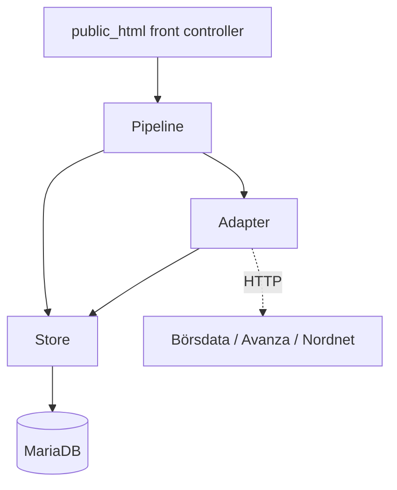
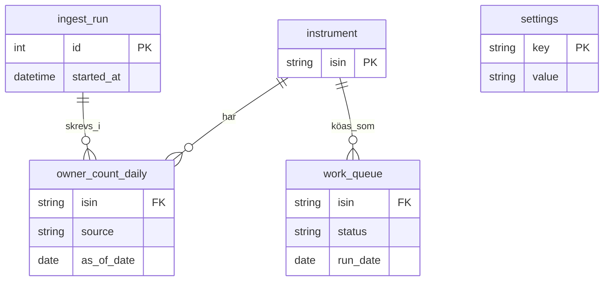
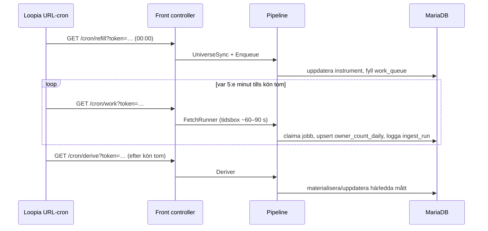

# Architecture Spine — Stockpicker

## Design Paradigm

**Pipes-and-filters** för dataflödet, **ports-and-adapters** för externa källor.

Nattkörningen är en kedja av filter med tydligt in/ut-kontrakt mellan varje steg:

```
universe-sync → enqueue → fetch → normalize → upsert → derive
```

Varje extern källa (Börsdata, Avanza, Nordnet) når systemet bara genom en adapter
bakom `SourceAdapter`-porten. Pipeline-kärnan känner aldrig HTTP, endpoint-vägar eller
källspecifika fältnamn.

Lagermappning:

| Lager | Katalog | Ansvar |
| --- | --- | --- |
| Front controller | `public_html/` | Tar emot cron-anrop, autentiserar token, startar pipeline-steg. Ingen affärslogik. |
| Pipeline | `src/Pipeline/` | Filtren: `UniverseSync`, `Enqueue`, `FetchRunner`, `Normalizer`, `Deriver`. |
| Adapter | `src/Adapter/` | `SourceAdapter`-interface + `BorsdataAdapter`, `AvanzaAdapter`, `NordnetAdapter`. |
| Store | `src/Store/` | PDO-repositories. Enda vägen till databasen. |

## Invariants & Rules



Tillåten beroenderiktning: front controller → pipeline → adapter/store; adapter → store.
Inget lager beror uppåt. Store beror inte på pipeline eller adapter.

### AD-1 — Pipes-and-filters med källadaptrar bakom en port

- **Binds:** all
- **Prevents:** att HTTP-egenheter, endpoint-vägar och källspecifik parsning läcker in i
  pipeline-kärnan och binder den till en viss källa.
- **Rule:** All åtkomst till en extern källa sker genom en klass som implementerar
  `SourceAdapter`. Pipeline-steg anropar bara adaptergränssnittet. Ingen `curl`/Guzzle,
  ingen käll-URL och ingen käll-DOM utanför `src/Adapter/`.

### AD-2 — Adaptern returnerar normaliserad rad eller typat fel

- **Binds:** `src/Adapter/`, `src/Pipeline/FetchRunner`, `Normalizer`
- **Prevents:** att kärnan grenar på statuskoder eller råsvar, och att olika adaptrar
  rapporterar fel på oförenliga sätt.
- **Rule:** En `fetch`-adapter returnerar antingen
  `{isin, source, as_of_date, number_of_owners, last_price, market_cap, fetched_at}`
  eller ett typat fel: `SchemaMismatch`, `NotFound`, `Transient`. Kärnan agerar bara på
  dessa typer.

### AD-3 — Dataägande: en skribent per rad `[ADOPTED]`

- **Binds:** `instrument`, `owner_count_daily`, `Deriver`
- **Prevents:** dubbla skribenter på samma rad och kapplöpning mellan källor.
- **Rule:** `instrument`-tabellen skrivs bara av `UniverseSync` (via `BorsdataAdapter`) —
  inklusive uppslag och cachning av Avanza `orderbookId` och Nordnet `nnx_instrument_id`.
  `FetchRunner` slår aldrig upp ett saknat id lat; ett instrument utan id hoppas över och
  loggas tills nästa `UniverseSync`. `owner_count_daily` är källindelad —
  `AvanzaAdapter`-flödet skriver bara rader med `source = 'avanza'`, Nordnet bara sina.
  `Deriver` och allt härlett läser fakta, skriver dem aldrig.

### AD-4 — Idempotent upsert på naturlig nyckel

- **Binds:** `src/Store/`, `owner_count_daily`
- **Prevents:** dubbletter när ett steg eller en hel körning körs om.
- **Rule:** All faktalagring är upsert med `(isin, source, as_of_date)` som nyckel.
  Ett omkört steg för samma dygn ger samma sluttillstånd.

### AD-5 — Återupptagbar, tidsboxad kökörning

- **Binds:** `public_html/` cron-endpoints, `Enqueue`, `FetchRunner`, `work_queue`
- **Prevents:** att en körning antar att den hinner klart i ett anrop (Loopias
  URL-cron kör över webbservern med okänd timeout) och att överlappande cron-scheman tar
  samma jobb.
- **Rule:** Inget pipeline-steg får förutsätta att det slutförs i en enda invokation.
  `FetchRunner` claimar köjobb atomiskt (`UPDATE work_queue SET status='claimed', …
  WHERE status='pending' … LIMIT n`), arbetar en tidsbox (default ~60–90 s) och avslutar
  rent. Den dagliga cron:en fyller kön; 5-minuters-cron:en betar av den tills den är tom.
- **Kö-tillståndsmaskin:** `pending → claimed → done | failed`. Bara `Enqueue` skapar
  `pending`-rader; bara `FetchRunner` gör övriga övergångar. En `claimed`-rad äldre än
  `queue.stale_after` (i `settings`) återöppnas till `pending` vid nästa körning — så en
  tidsbox som avbryts mitt i inte lämnar jobb fast.

### AD-6 — Delfel avbryter aldrig en körning

- **Binds:** `FetchRunner`, `src/Store/`, `ingest_run`
- **Prevents:** att ett trasigt instrument eller en nere källa stoppar allt annat.
- **Rule:** `NotFound` och `SchemaMismatch` loggas per instrument och körningen går
  vidare. `Transient` återförsöks med exponentiell backoff, sedan lämnas jobbet för
  nästa körning. Efter varje slice framgår antal lyckade/misslyckade per källa.

### AD-7 — Schemakontroll vid adaptergränsen

- **Binds:** `src/Adapter/`
- **Prevents:** att en tyst fältändring hos en inofficiell endpoint sparas som `null`.
- **Rule:** Varje adapter validerar svaret mot ett förväntat schema. Saknat eller
  förändrat fält ⇒ `SchemaMismatch` (aldrig ett tomt värde vidare), loggas på
  `warning`-nivå och räknas i `ingest_run`.

### AD-8 — Hemligheter i fil, drift-parametrar i tabell

- **Binds:** `config.php`, `settings`-tabellen, all kod som läser konfiguration
- **Prevents:** hemligheter i webroot eller i versionshanteringen, och att en
  parameterändring kräver deploy.
- **Rule:** DB-uppgifter och cron-token ligger i `config.php` utanför `public_html/`.
  Drift-parametrar (kör-inte-före-tid för K3, batchstorlek, anrop/s per källa) ligger i
  `settings`-tabellen och läses vid varje körning.

### AD-9 — Strypning i pipeline, aldrig parallella massanrop

- **Binds:** `FetchRunner`, `src/Adapter/`
- **Prevents:** att en enskild adapter kringgår anropsbudgeten och att flera källor
  hamras samtidigt.
- **Rule:** Anrop mot externa källor sker seriellt. `FetchRunner` upprätthåller
  strypning per källa (anrop/s från `settings`) med exponentiell backoff vid 429 eller
  strypning. Adaptrar startar inga egna trådar/parallella anrop.

### AD-10 — Personligt bruk är en arkitekturgräns

- **Binds:** all
- **Prevents:** drift mot något som redistribuerar data eller genererar hög trafik.
- **Rule:** Ingen komponent exponerar hämtad data utåt. Anropsvolymen hålls låg via
  `settings`. Cron-endpoints är inte publika — de kräver token (AD-8).

### AD-11 — Varje körning är inspekterbar i efterhand

- **Binds:** `ingest_run`, `FetchRunner`, `UniverseSync`, Monolog
- **Prevents:** tyst dataförlust — att man inte vet att en natt gick fel.
- **Rule:** Varje slice skriver till `ingest_run` (starttid, sluttid, antal instrument,
  lyckade/misslyckade per källa, schemaavvikelser). `UniverseSync` loggar antal
  tillkomna/borttagna/ändrade bolag. Loggar går via Monolog till fil.

## Consistency Conventions

| Concern | Convention |
| --- | --- |
| Adapternamn | `<Källa>Adapter` i `src/Adapter/`, implementerar `SourceAdapter` |
| Pipeline-steg | Verb-substantiv-klass i `src/Pipeline/` (`UniverseSync`, `FetchRunner`) |
| Tabeller & kolumner | `snake_case`, singular tabellnamn (`instrument`, `owner_count_daily`, `work_queue`, `ingest_run`, `settings`) |
| Instrumentidentitet | ISIN är naturlig nyckel överallt; Avanza/Nordnet-id är cachade attribut på `instrument` |
| Datum | ISO-8601. `as_of_date` är ett kalenderdatum i tidszonen `Europe/Stockholm` — härlett ur källans tidsstämpel när den finns (Nordnet `statistics_timestamp`), annars körningsdatum. Alla källors rader för samma dygn får därmed samma `as_of_date`. `fetched_at` (UTC-tidsstämpel) alltid satt. |
| Fel | PHP-klasser: `SchemaMismatch`, `NotFound`, `Transient` — kastas/returneras av adaptrar, aldrig råa undantag vidare till kärnan |
| Databasåtkomst | Bara genom `src/Store/`-repositories (PDO). Ingen SQL i pipeline eller adapter. |
| Loggning | Monolog; `warning` för schemaavvikelse, `error` för oväntat undantag |
| Cron-autentisering | Delad token i query-parametern, jämförs `hash_equals` mot `config.php` |

## Stack

| Name | Version |
| --- | --- |
| PHP | 8.3 (8.4/8.5 finns hos Loopia) |
| MariaDB | 10.6 |
| Composer | 2.x |
| guzzlehttp/guzzle | ^7.9 \|\| ^8.0 |
| monolog/monolog | ^3.11 |
| robmorgan/phinx | ^0.16.12 (CakePHP-underhållet) |
| Plattform | Loopia delat Unix-webbhotell (Privatpaket) — SSH, URL-cron |

## Structural Seed

```text
stockpicker/
  public_html/
    index.php          # front controller: /cron/refill, /cron/work, (senare) UI
  src/
    Adapter/           # SourceAdapter, BorsdataAdapter, AvanzaAdapter, NordnetAdapter
    Pipeline/          # UniverseSync, Enqueue, FetchRunner, Normalizer, Deriver
    Store/             # InstrumentRepository, OwnerCountRepository, QueueRepository, RunRepository, SettingsRepository
    Error/             # SchemaMismatch, NotFound, Transient
  bin/                 # engångsskript körda via SSH
  db/migrations/       # Phinx
  config.php           # utanför public_html — DB-uppgifter, cron-token
  vendor/
```

Kärnentiteter (namn och relationer; attribut som är invarianter står som AD, inte här):



Körflöde per natt:



## Capability → Architecture Map

| Krav | Lever i | Styrs av |
| --- | --- | --- |
| K1 Universum (Börsdata) | `BorsdataAdapter`, `UniverseSync` | AD-1, AD-3 |
| K1b Daglig universumavstämning | `UniverseSync`, `Enqueue` | AD-3, AD-11 |
| K2 Daglig hämtning | `FetchRunner`, käll-adaptrar | AD-1, AD-2, AD-5 |
| K3 Konfigurerbar körtid | `settings`-tabell, front controller | AD-8 |
| K4 Idempotens | `OwnerCountRepository` | AD-4 |
| K5 Tidsserielagring | `owner_count_daily`, `Store/` | AD-3, AD-4, konvention (datum) |
| K6 Instrumentmatchning (ISIN) | `instrument`, `UniverseSync` | AD-3, konvention (identitet) |
| K7 Felhantering | `FetchRunner`, `Error/` | AD-2, AD-6 |
| K8 Rate limiting | `FetchRunner` | AD-9 |
| K9 Kontrakts-/schemakontroll | käll-adaptrar | AD-7 |
| K10 Härledda mått | `Deriver`, SQL-vyer (MariaDB window functions) | AD-3 |
| K11 Efterlevnad | hela systemet | AD-10 |
| K12 Observerbarhet | `ingest_run`, Monolog | AD-11 |

## Deferred

- **Presentations-/analyslager.** Utanför v1 enligt briefen. Spinen reserverar
  `public_html/` för en framtida läsvy men fixerar inget om den.
- **Härledda mått: vy vs materialiserad tabell (K10).** `Deriver` finns i strukturen;
  om måtten blir SQL-vyer eller en materialiserad `owner_metrics_daily`-tabell avgörs vid
  implementation, styrt av hur tunga uttagen blir. AD-3 gäller oavsett.
- **Exakt schema (kolumntyper, index) och de kanoniska `settings`-nycklarna.** Ägs av
  `db/migrations/` när koden finns; nyckelnamn som `run_after`, `batch_size`,
  `rate.<källa>`, `queue.stale_after` sätts i första migrationen. Endast naturliga
  nycklar och ägande är fixerade här.
- **Databasval bortom v1.** MariaDB 10.6 är bundet av plattformen. Om ett analyslager
  senare kräver annat är det ett nytt beslut.
- **Retry-/backoff-parametrar.** Startvärden i `settings`; trimmas i drift.
- **Definition av "tillfällig topp" / spikindikator.** Öppen fråga i briefen, medvetet
  uppskjuten tills det finns historik.
- **Loopias verkliga exekveringstidsgräns för URL-cron.** Okänd; AD-5 gör
  arkitekturen robust oavsett. Värt en supportfråga till Loopia före driftsättning.
