# Stockpicker — UX-granskningsunderlag för Lovable

> Detta dokument beskriver hur webbappen **stockpicker** faktiskt ser ut och beter sig idag
> (2026-09-27), extraherat direkt ur den körande koden (server-renderad HTML/CSS, inga
> byggverktyg). Syftet är att ge Lovable tillräckligt med kontext för att granska gränssnittet
> — visuell hierarki, konsekvens, tillgänglighet, mobilanpassning — utan tillgång till själva
> källkoden eller en körande instans.
>
> Detta är **inte** en kravspec. Ursprunglig UX-design finns dokumenterad separat i
> `_bmad-output/planning-artifacts/ux-designs/ux-stockpicker-2026-09-12/DESIGN.md` och
> `EXPERIENCE.md` — det här dokumentet beskriver vad som faktiskt är byggt, inklusive ställen
> där implementationen avviker eller är inkonsekvent.

## 1. Vad appen är

Ett internt, ensam-användar-verktyg för att följa **antal ägare** (owner count) för svenska
aktier hos Avanza och Nordnet över tid, och upptäcka aktier med stadigt växande eller
plötsligt spikande ägarantal. Allt innehåll är på svenska. Ingen self-service-registrering —
en enda hårdkodad inloggning.

**Sidor (samtliga kräver inloggning utom /login):**

| Route | Sida | Syfte |
|---|---|---|
| `/login` | Logga in | Enda ingången, formulär med användarnamn/lösenord |
| `/` | Topplista | Startsidan efter inloggning. Topp 10, rankade |
| `/list` | Fullständig lista | Alla instrument, med sök/sortering/filter |
| `/watchlist` | Bevakningslista | Användarens stjärnmärkta instrument |
| `/stock/{isin}` | Aktiedetalj | Ett instrument: graf över tid + länk till Avanza |
| `/info` | Information | Statisk förklaringstext om sidorna och symbolerna |

## 1b. Skärmdumpar

Tagna 2026-09-27 mot en lokal instans med riktig (om än gles) testdata — 20 instrument, 45
lagrade ägarantalsrader. Där historiken är kort visar skärmdumparna det på riktigt (t.ex.
"Inte tillräckligt med historik…"), vilket också är appens verkliga tom/gles-state, inte en
konstruerad demo.

**Desktop (≥900px, kort-layout):**

| | |
|---|---|
| 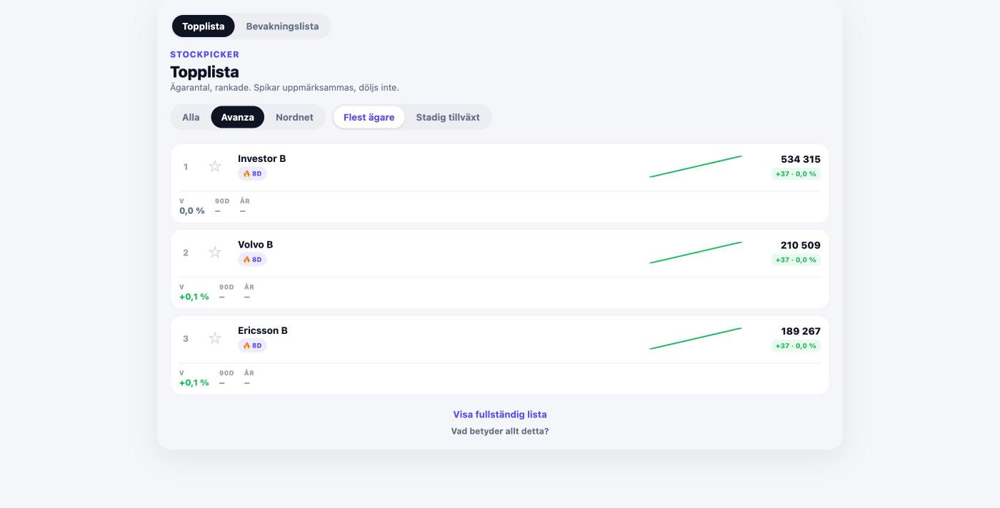 Topplista — Avanza, "Flest ägare" | 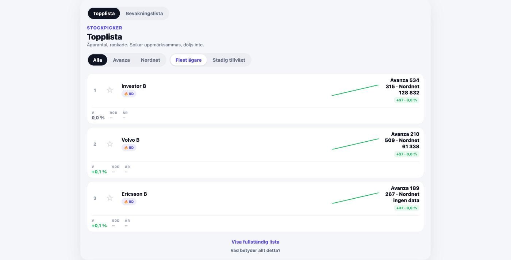 Topplista — "Alla"-läge (Avanza+Nordnet sida vid sida) |
| 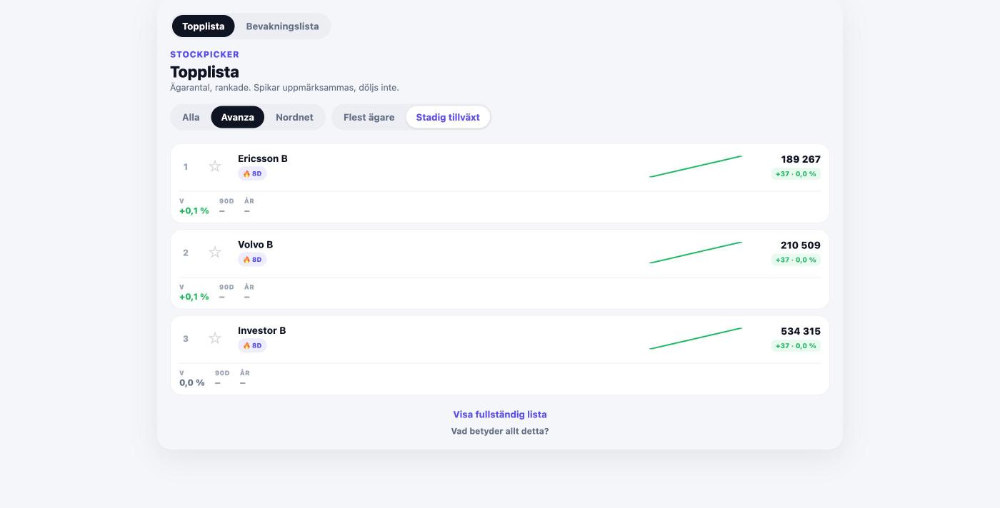 Topplista — "Stadig tillväxt" | 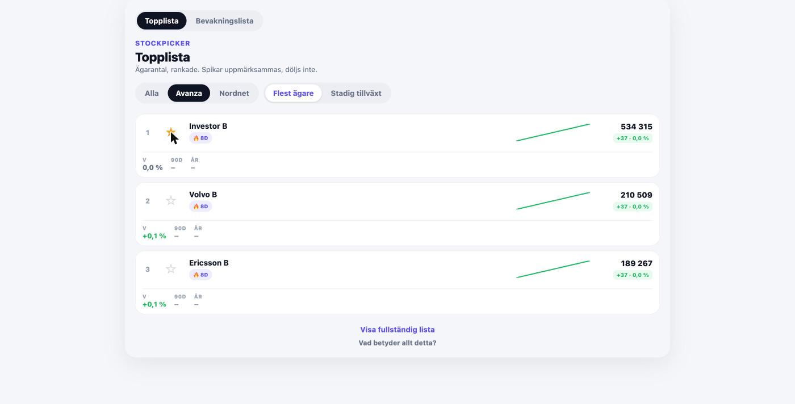 Topplista — efter klick på bevakningsstjärnan (fylld, optimistisk) |
| 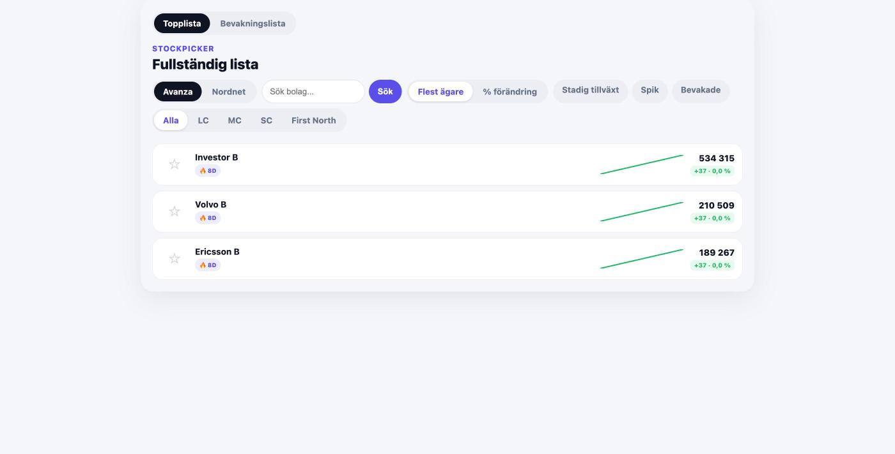 Fullständig lista — grundläge | 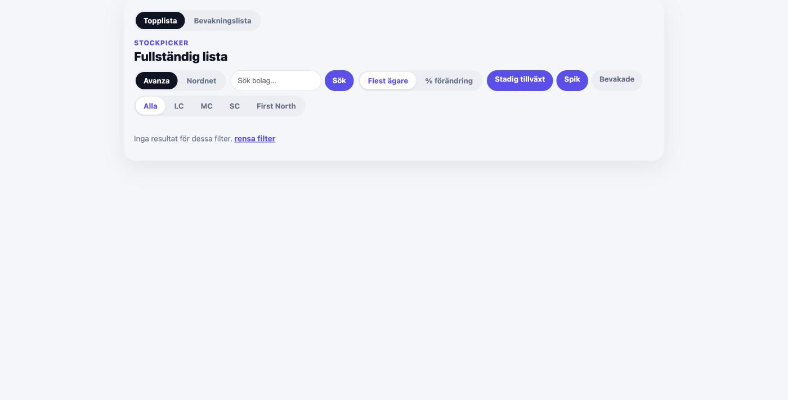 Fullständig lista — "Stadig tillväxt"+"Spik" kombinerat, inget matchar |
| 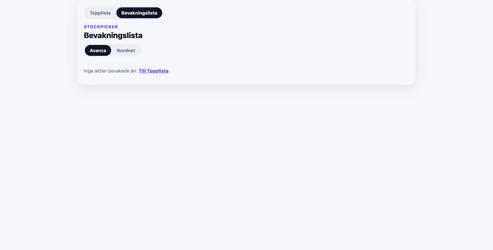 Bevakningslista — tomt läge | 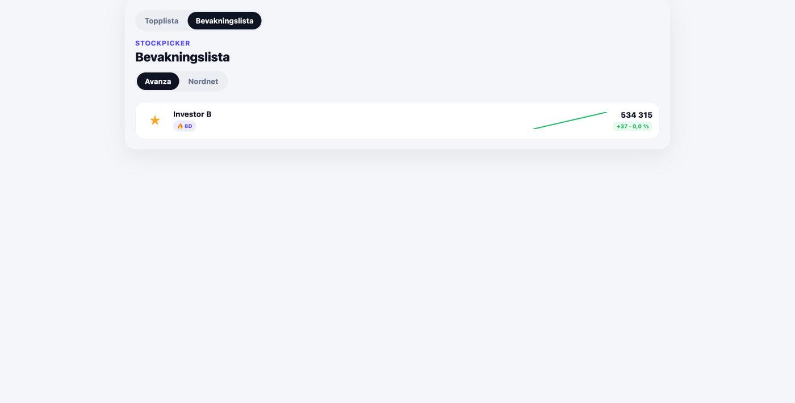 Bevakningslista — med en stjärnmärkt aktie |
| 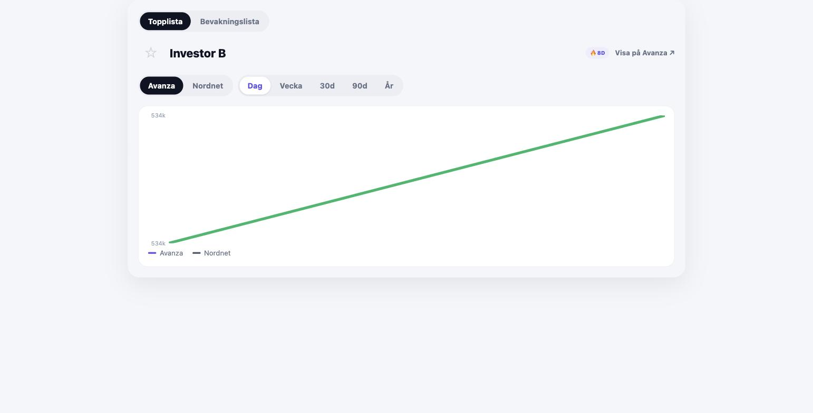 Aktiedetalj — intervall "Dag" | 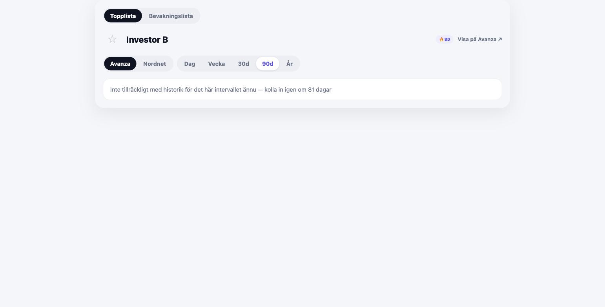 Aktiedetalj — intervall "90d", otillräcklig historik |
| 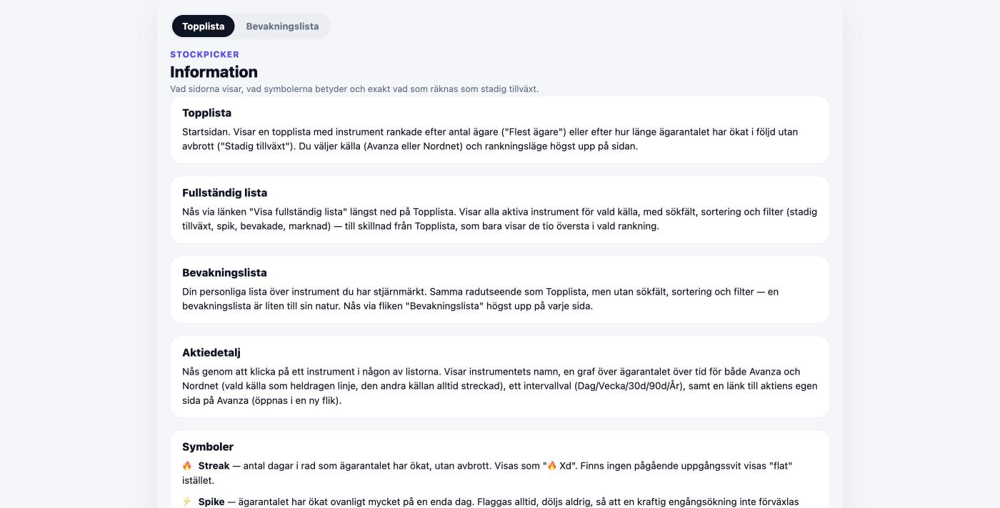 Information | |

**Mobil (390px bredd):**

| | | |
|---|---|---|
| 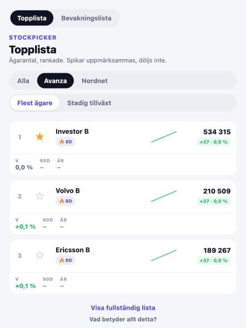 | 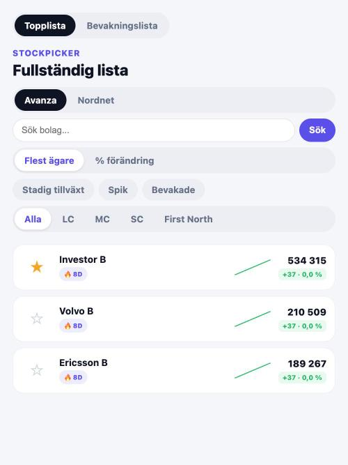 | 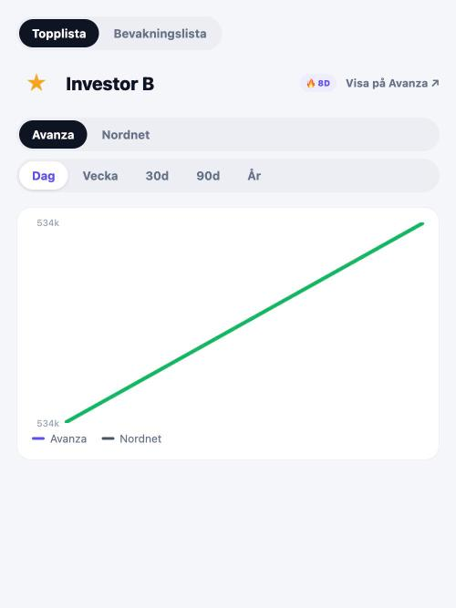 |
| Topplista | Fullständig lista (alla kontroller staplade) | Aktiedetalj |

**Login-sidan är inte avbildad här**: `GET /login` gör en 302-redirect till `/` så fort en
giltig sessions-cookie finns (`public_html/index.php`, `/login`-fallet), så den går inte att
skärmdumpa utan att först logga ut den aktiva sessionen. Avsnitt 5.1 nedan beskriver dess
(helt ostylade) HTML/CSS exakt som den ser ut i koden — säg till om du vill att jag loggar ut
och tar den skärmdumpen också.

## 2. Tekniska ramar (viktigt för vilka förslag som är genomförbara)

- **Server-renderad HTML per request**, ingen SPA, inget byggsteg, inget CSS/JS-ramverk.
  All HTML byggs som PHP heredoc-strängar i fem controller-klasser.
- **All CSS är inline `<style>`** i varje sidas `<head>`, och **CSS är dupliceradbyte-för-byte**
  mellan Topplista/Fullständig lista/Bevakningslista/Aktiedetalj (fyra separata, nästan
  identiska kopior av samma design-tokens och komponentklasser). Info-sidan har sin egen,
  mindre CSS-fil utan färgkodning för positiv/negativ/spike.
- **Exakt en JS-fil existerar** (`public_html/assets/watchlist.js`, ~80 rader vanilla JS, inget
  bibliotek): den hanterar enbart bevakningsstjärnans optimistiska klick-toggle. Allt annat —
  sök, sortering, filter, källbyte, rankningsläge, intervallval — är vanliga `<a href>`-länkar
  eller ett GET-`<form>`. Varje interaktion utom stjärnan innebär en full sidladdning.
- **Ingen state sparas mellan sidladdningar** (inte ens i en session) — källa/rankning/sök/
  filter lever enbart i query-strängen och måste explicit föras vidare länk för länk (vilket
  koden gör konsekvent, se AD-14-kommentarer i källkoden).
- Detta betyder: förslag som kräver client-side state, ett komponentbibliotek, eller SPA-
  navigering är stora arkitekturändringar, inte CSS-justeringar. Lovable bör flagga om ett
  förslag förutsätter JS som inte finns.

## 3. Designspråk / tokens (som de faktiskt används i koden)

Samma paletter upprepas (med smärre luckor, se avsnitt 6) i Topplista/Lista/Bevakning/Detalj:

```css
--bg-app: #F5F6FA;        /* sidbakgrund, ljusgrå */
--bg-surface: #FFFFFF;    /* kort/rader */
--border: #E4E7EC;
--row-border: #EEF0F5;
--control-bg: #ECEEF3;    /* pill-bakgrund för switchar/toggles */
--text-primary: #101323;  /* nästan svart */
--text-secondary: #667085;
--text-muted: #98A2B3;
--brand: #5B4FE9;         /* lila-blå accent */
--brand-tint: #EEEDFD;
--positive: #12B76A;      /* grön */
--positive-tint: #E7F9F0;
--negative: #F04438;      /* röd */
--negative-tint: #FEECEB;
--spike-bg: #FEF0C7;      /* gul-beige spik-badge */
--spike-text: #7C5800;
--star-filled: #F5A623;   /* orange stjärna */
--star-empty: #D0D5DD;
--nohist-bg: #F2F4F7;
--secondary-line: #475467; /* endast Aktiedetalj: sekundär källas linje */
```

- **Typsnitt:** systemets sans-serif-stack (`-apple-system, BlinkMacSystemFont, "Segoe UI",
  Helvetica, Arial, sans-serif`), inget eget webbtypsnitt.
- **Skala:** rubrik (h1) 20–22px/vikt 800, brödtext/rader 13–13.5px, etiketter/badges 9–12px,
  allt i vikt 700–800 (appen har i praktiken ingen "normal" textvikt — allt är fetstilt eller
  halvfett).
- **Form:** genomgående mycket rundade hörn — piller (`border-radius: 9999px`) för alla
  switchar/knappar/taggar, 16px radie för kort/rader, 20px för hela sidramen på desktop.
  Inga skarpa hörn någonstans i appen.
- **Container:** allt centrerat i en kolumn, `max-width: 720px` på mobil, `960px` från 900px
  och uppåt då sidan även får en synlig kortram (box-shadow + rundade hörn) mot appbakgrunden
  — dvs. appen är designad mobile-first och "växer ut" till ett kort på desktop snarare än att
  fylla bredden.
- **Enda brytpunkt:** `@media (min-width: 900px)`. Det finns ingen mellannivå (t.ex. tablet-
  specifik layout) och ingen körningskontrollerad reflow under 900px förutom flex-wrap.
- **Färgkodning är konsekvent semantisk** genom hela appen: grönt = uppgång, rött = nedgång,
  gult/beige = "spik" (varning, inte fel), lila/brand = aktivt/vald, grå = neutral/ingen data.

## 4. Delad layout-struktur (alla fyra huvudsidor)

```
<div class="page">                      max-width 720/960px, centrerad
  <tab-bar>  Topplista | Bevakningslista  (pill-par, aktiv = mörk bakgrund)
  <header>
    STOCKPICKER  (liten versal wordmark, brand-färg)   ← saknas på Aktiedetalj
    <h1>Sidtitel</h1>
    <p class="subtitle">…</p>                          ← saknas på Aktiedetalj/Bevakning
    <div class="controls">…switchar/filter/sök…</div>
  </header>
  <main>…innehåll…</main>
  [sidfot-länkar, endast Topplista: "Visa fullständig lista", "Vad betyder allt detta?"]
</div>
<script src="/assets/watchlist.js" defer></script>
```

Alla fyra sidor delar en **byte-för-byte identisk tab-bar-implementation**, kopierad in i
varje controller separat (kodkommentarer erkänner detta öppet som medveten teknisk skuld —
"ingen delad layoutfil finns").

## 5. Sida för sida

### 5.1 Login (`/login`)
**Helt ostylad.** Ingen `<style>`-tagg alls, ingen CSS-variabel, inget wordmark, ingen
container. Bara `<h1>Logga in</h1>` + två `<label>`-fält (text/password) + submit-knapp,
renderat med webbläsarens standardstilar (Times/serif-ish beroende på webbläsare). Vid fel
visas ett `<p class="error">`-meddelande utan att `.error` någonsin definieras i CSS. Detta är
den enda sidan i appen som inte följer designspråket ovan — en tydlig avvikelse värd att
granska. Bekräftat i koden: `GET /login` gör en 302-redirect till `/` om sessionscookien redan
är giltig (ingen som är inloggad kan alltså av misstag se den ostylade sidan igen).

### 5.2 Topplista (`/`) — startsidan
- Wordmark + `<h1>Topplista</h1>` + underrubrik: *"Ägarantal, rankade. Spikar
  uppmärksammas, döljs inte."*
- **Källswitcher** (pill-grupp): Alla / Avanza / Nordnet — tre lägen. I "Alla"-läge visas
  Avanzas och Nordnets ägarantal sida vid sida per rad ("Avanza 12 345 · Nordnet ingen
  data"), aldrig summerade.
- **Rankningsväxel** (pill-grupp): "Flest ägare" / "Stadig tillväxt".
- Topp 10-rader, varje rad:
  - Ranknummer (1–10)
  - ☆/★ bevakningsstjärna (44×44px klickyta, optimistisk toggle via JS)
  - Namn (trunkeras med ellipsis vid platsbrist) + badges under namnet: 🔥 streak-badge
    (t.ex. "🔥 5d") eller neutral "flat"-badge, plus ⚡ spike-badge när relevant (visas
    *alltid* när spik upptäcks — döljs aldrig, ett explicit designval)
  - Sparkline: liten SVG-linjegraf (30 dagars ägarantal), färgkodad efter riktning
    (grön/röd/lila/grå-streckad om <7 dagars historik finns)
  - Ägarantal + delta-chip ("+412 · 0,9 %", färgkodad grön/röd/grå)
  - En rad under raden: period-procent för Vecka/90d/År ("–" när otillräcklig historik)
  - Hela raden (utom stjärnan) är en klickbar länk till Aktiedetalj
- Sidfot: två textlänkar ("Visa fullständig lista", "Vad betyder allt detta?")
- Tom-state: "Inga aktier hittades." / "Inga aktier med stadig tillväxt just nu."

### 5.3 Fullständig lista (`/list`)
Samma radutseende som Topplista, men **utan** period-procent-raden och med rikare
kontroller i headern: källswitcher, ett fritextsökfält (`<form method="get">` + knapp
"Sök"), sorteringsväxel ("Flest ägare" / "% förändring"), tre oberoende av/på-filter
("Stadig tillväxt" / "Spik" / "Bevakade" — fyllda piller när aktiva) och ett enkelval-
marknadsfilter ("Alla" + en pill per marknad). Alla kombineras och skickas som
query-parametrar; sökfältet bär tyst med sig alla andra aktiva filter som dolda fält så att
en ny sökning aldrig nollställer resten.

Notera: rad-statkolumnen är här 70px bred (mot 100px på Topplista) eftersom
period-procent-raden saknas — en av flera små, odokumenterade mått-/layoutskillnader mellan
sidorna trots i övrigt identisk CSS.

### 5.4 Bevakningslista (`/watchlist`)
Identisk radlayout med Fullständig lista, men header har **bara** källswitchern — inget
sökfält, ingen sortering, inga filter ("en bevakningslista är liten till sin natur", enligt
kodkommentar). Tom-state länkar troligen tillbaka till Topplista/Lista (empty-state har egen
länkstil `.empty-state a`).

### 5.5 Aktiedetalj (`/stock/{isin}`)
Avviker mest strukturellt från de andra tre:
- Header utan wordmark/underrubrik: stjärna + `<h1>` (bolagsnamn) + badges + en extern länk
  "Visa på Avanza ↗" (`target="_blank"`, öppnas i ny flik, egen `aria-label`).
- Kontroller: källswitcher (Avanza/Nordnet) + intervallväljare (Dag / Vecka / 30d / 90d / År),
  båda pill-grupper.
- Ett **linjediagram** (ren SVG, ingen chart-bibliotek): egen vänsterställd y-axel med
  textetiketter, huvudlinjen för vald källa (färgkodad efter riktning/spik/ingen-historik
  precis som sparklinen), och sekundära källans linje inprickad ovanpå som en tunnare,
  streckad grå linje om data finns. Legend under grafen visar båda källorna, med kursiv
  "(ingen data ännu)" för den som saknas.
- Tom-state vid otillräcklig historik: textmeddelande istället för diagram.

### 5.6 Information (`/info`)
Statisk, ostyrbar sida. Egen (mindre, urvattnad) CSS: samma korta wordmark/header-mönster
men korten (`<section>`) saknar färgkodning helt — ingen brand/positive/negative-variabel
används här förutom för wordmark och aktiv flik. Innehåller written-out-förklaringar av varje
sida, varje symbol (🔥/⚡/☆★/delta-chip) och den exakta regeln för "Stadig tillväxt".

## 6. Återanvända komponenter (samma klassnamn/markup i flera controllers)

| Komponent | Beskrivning |
|---|---|
| **Tab-bar** | Topplista / Bevakningslista, pill-par, mörk bakgrund på aktiv |
| **Källswitcher** | Avanza / Nordnet (+ ibland Alla), pill-grupp, mörk bakgrund på aktiv |
| **Rad (`.row`)** | Vitt kort, rundade hörn, stjärna + namn/badges + sparkline + antal/delta |
| **Bevakningsstjärna** | ☆/★, 44×44px klickyta, optimistisk JS-toggle, `aria-pressed` |
| **Badge** | Pill, versaler, 9px: streak (lila), spike (gul), "flat"/nohist (grå) |
| **Delta-chip** | "+412 · 0,9 %", färgkodad grön/röd/grå bakgrundston |
| **Sparkline** | Liten SVG-linje, färgkodad, med textetikett vid otillräcklig historik |
| **Empty state** | `<p class="empty-state">`, grå text, ibland med länk |

## 7. Interaktionsmönster

- **Optimistisk stjärn-toggle**: klick ändrar UI direkt, serverbekräftelse i bakgrunden;
  401 → full redirect till `/login`; övriga fel → optimistiskt state består till nästa
  sidladdning; knappen inaktiveras under pågående request för att förhindra dubbelklick-race.
- **Allt annat är full sidladdning**: varje filter/sök/sortering/källbyte/intervallbyte är en
  vanlig länk eller GET-formulär — ingen AJAX, ingen partial re-render, ingen laddningsindikator
  någonstans utöver webbläsarens egen.
- **Ingen bekräftelsedialog** någonstans i appen (varken för stjärnan eller annat).
- Extern länk (Avanza) är enda `target="_blank"`, med `rel="noopener noreferrer"` och tydlig
  `aria-label` som nämner att den öppnas i ny flik.

## 8. Tillgänglighet — vad som redan finns

- `role="tablist"` + `aria-label` på samtliga pill-grupper (källswitcher, rankningsväxel,
  intervallväljare, marknadsfilter, tab-bar).
- `aria-pressed` på bevakningsstjärnan och på Fullständig listas filter-toggles.
- `aria-label` på stjärnan som beskriver handlingen ("Lägg till i/Ta bort från
  bevakningslistan"), inte bara symbolen.
- Sparklines/diagram är `aria-hidden="true"` (rent dekorativa; siffrorna bredvid bär
  informationen) — diagrammets `<svg>` på Aktiedetalj har dock `role="img" aria-label="Trend"`
  vilket är inkonsekvent med sparklinens `aria-hidden`.
- Klickytor: stjärnan är explicit 44×44px (uppfyller gängse minsta touch-target), men flera
  pill-länkar (`.tab`, `.filter-toggle`) har bara `padding: 8px 14px` utan garanterad
  minsta höjd — värt att mäta på faktisk touch-yta.
- **Inte verifierat här** (kräver rendering, inte bara källkod): faktisk färgkontrast för
  `--text-muted` (#98A2B3) och `--text-secondary` (#667085) mot vit/ljusgrå bakgrund, och
  tab-ordning genom kontrollerna.

## 9. Kända inkonsekvenser / öppna frågor att be Lovable titta extra på

1. **Login-sidan är helt ostylad** — enda sidan utan designspråket. Medvetet (inga JS/CSS-
   beroenden krävs för att logga in) eller ett förbisett hål?
2. **CSS är duplicerad fyra gånger** (en kopia per sida) med små, oavsiktligt uppkomna
   skillnader (t.ex. `.statcol` är 100px på Topplista men 70px på Lista/Bevakning, eftersom
   bara Topplista har period-procent-raden). Risk för visuell drift över tid.
3. **Info-sidans kort saknar all färgkodning** som resten av appen bygger sin visuella logik
   kring (grön/röd/gul) — känns som en annan, plattare produkt.
4. **Diagrammets `aria-label="Trend"` vs. sparklinens `aria-hidden`** — inkonsekvent
   tillgänglighetsbehandling av visuellt likartade element.
5. **Ingen laddningsindikation** för fulla sidladdningar (sök, filter, källbyte) — på en
   långsam anslutning ger detta ingen visuell feedback mellan klick och ny sida.
6. **Ingen tom/fel-hantering vid nätverksfel för stjärnan** utöver "reload för att synka" —
   ingen toast eller felmeddelande visas till användaren.
7. Appen har **inget mörkt läge** och inget sätt att välja ett — allt är hårdkodat ljust tema.
8. Endast två brytpunkter (mobil / ≥900px) — ingen validering här av hur layouten beter sig i
   det vanliga surfplatte-/smal-labtop-intervallet (t.ex. 700–899px, precis under brytpunkten
   där kontrollerna staplas vertikalt men kortet ännu inte fått sin ram).

## 10. Vad vi vill ha ut av granskningen

Fri bedömning av: visuell hierarki och informationstäthet i radlistorna (mycket information
per rad — rank, stjärna, namn, badges, trend, antal, delta, periodprocent), konsekvens mellan
de fem sidorna, om det fetstilstunga typsnittssystemet (nästan ingen "normal" vikt någonstans)
känns tungt över en hel sida, och om pill-baserade kontroller skalar bra när fler filter läggs
till (Fullständig lista har redan källa+sök+sortering+3 filter+marknad i en enda header).
